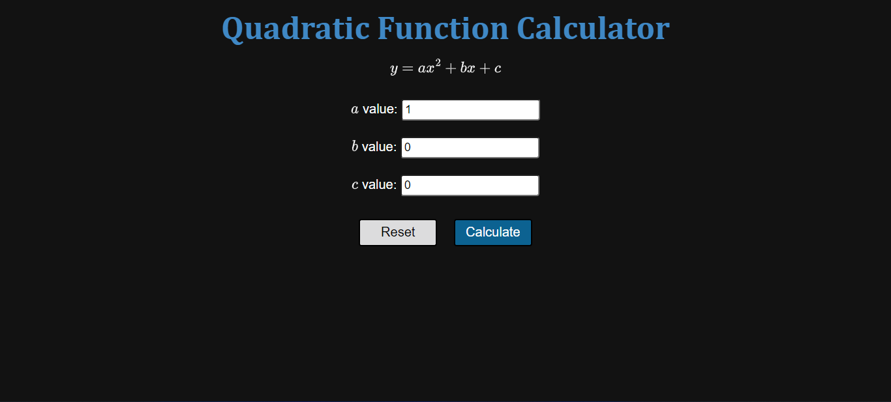
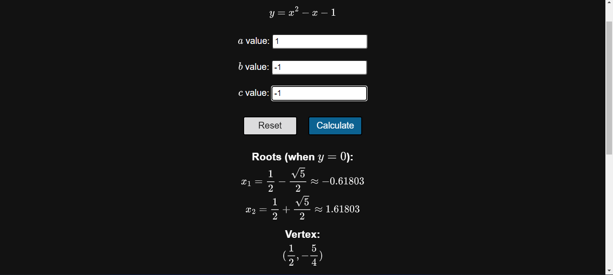
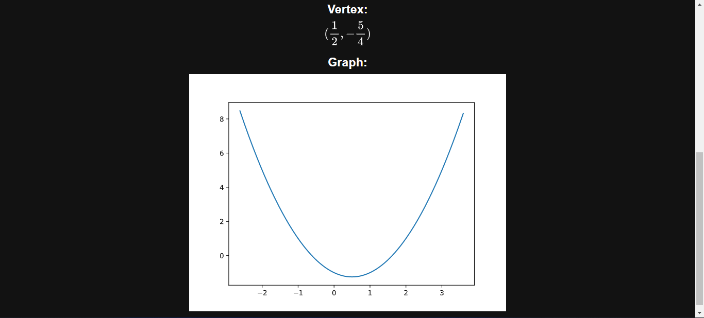

# Quadratic Function Calculator

This is a personal project for a web quadratic function calculator, that takes input data and shows output data.

The page gets the coefficients from the input data and instantiates the QuadraticFunction class. Its constructor uses Algebrite, a javascript library for symbolic computation, to calculate the function's roots and vertex coordinates. The class uses mathjs, a extensive math library, to calculate the plot points witch are used by Plotly, a data visualization library, to get the plot.

The other data is formatted using MathJax, a Javascript library for converting Latex to svg and other formats, and displayed to the user.

<figure>

<figcaption>Webpage open in browser</figcaption>
</figure>

<figure>

<figcaption>Example of evaluating an expression: inputs, roots and vertex</figcaption>
</figure>

<figure>

<figcaption>Example of evaluating an expression: vertex and graph</figcaption>
</figure>
